<!-- _class: lead -->
<!-- _paginate: false -->

# Programación Paralela Moderna en Python para HPC e IA

Medir. Vectorizar. Compilar. Luego, y solo entonces, paralelizar.

Tres horas, un ejemplo que se desarrolla de principio a fin, todo en Colab.

---

# El recorrido

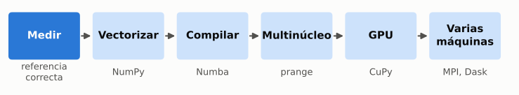

Cada paso se justifica con una medición del paso anterior.
Una versión más rápida que da otro resultado no cuenta.

---

# Resultados de aprendizaje

1. Establecer un resultado de referencia correcto y medir ejecuciones repetidas de manera justa.
2. Comparar Python, NumPy y Numba; explicar por qué más hilos no siempre ayudan.
3. Ejecutar el cálculo con CuPy, comprobar el resultado y separar el tiempo de cálculo del tiempo con transferencias.
4. Explicar cuándo las partes de un cálculo deben comunicarse y elegir entre un administrador de tareas y el paso de mensajes.

No se busca una aceleración específica. Se buscan resultados correctos y explicados.

---

# El ejemplo: difusión de calor en una cuadrícula

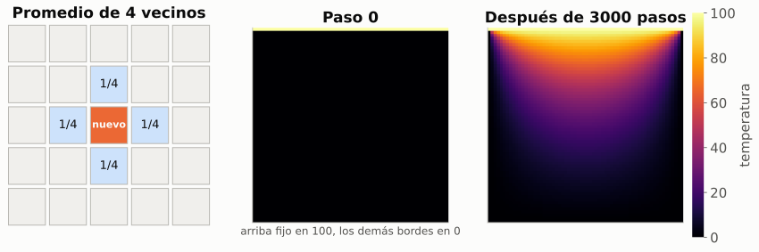

Cada celda interior pasa a ser el promedio de sus cuatro vecinos. Los bordes no cambian.

---

# La misma operación, en NumPy

```python
unew[1:-1, 1:-1] = 0.25 * (u[:-2, 1:-1] + u[2:, 1:-1] + u[1:-1, :-2] + u[1:-1, 2:])
```

- Los cortes (`u[:-2, 1:-1]`) son **vistas**: no copian datos.
- Cada `+` y el `*` **asignan un array intermedio**: cuatro arrays temporales por paso.
- El bucle de Python puro es la **referencia**. Toda versión más rápida debe coincidir con él:

```python
assert np.allclose(run(step_numpy, n, iters), ref)
```

---

<!-- _class: lead -->

# Bloque 1: medir

---

# La primera ejecución no es una medición

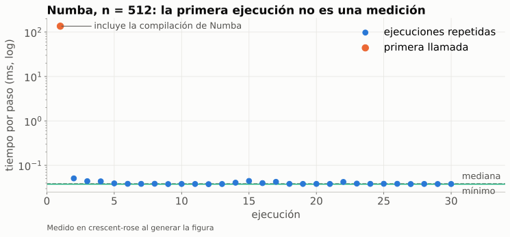

---

# ¿Qué contiene un tiempo de ejecución?

- **Calentar** primero: compilación, importaciones, cachés, asignaciones.
- **Repetir**, e informar el mínimo (menos interferencia) o la mediana (típico). Indicar cuál.
- `%timeit` imprime **promedio +- desviación estándar**; `.best` está disponible si se pide.
- **Mismo experimento**: mismo entorno, carga de trabajo, tipo de dato y número de pasos.
- En una GPU: **sincronizar** antes de iniciar y antes de detener el cronómetro.

Un número de otra máquina corresponde a otro experimento.

---

# NumPy contra Numba, un solo hilo

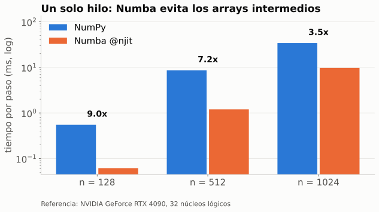

Numba no es más rápido por ser paralelo: aquí no lo es. Lo es porque evita los arrays intermedios.

---

<!-- _class: lead -->

# Bloque 2: varios núcleos

---

# `prange`: el mismo bucle, repartido entre hilos

```python
@njit(parallel=True)
def step_numba_par(u, unew):
    n, m = u.shape
    for i in prange(1, n - 1):        # cada hilo recibe un bloque de filas
        for j in range(1, m - 1):
            unew[i, j] = 0.25 * (u[i-1, j] + u[i+1, j] + u[i, j-1] + u[i, j+1])
    return unew

numba.set_num_threads(min(wanted, os.cpu_count()))
```

- Consultar al entorno cuántos hilos hay; no suponerlo. Colab con CPU suele informar 2.
- Pedir más hilos que núcleos no da error: solo es más lento.

---

# Ley de Amdahl frente a la medición

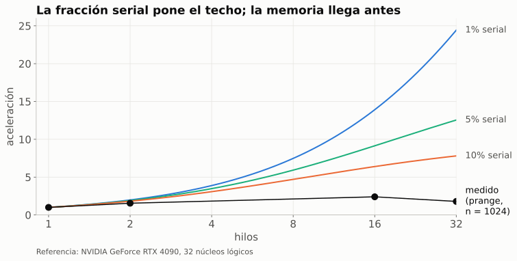

<span class="small">`speedup(p) = 1 / (s + (1 - s) / p)`. Con 10% serial: 3.1x con 4 núcleos, 6.4x con 16, nunca más de 10x.</span>

---

# ¿Por qué la curva medida se queda tan abajo?

- El cálculo hace 4 operaciones por cada 5 lecturas de memoria: está **limitado por el ancho de banda**.
- Los hilos comparten el mismo bus de memoria; más hilos no traen más bytes por segundo.
- Los hilos de hardware (hyperthreads) comparten un núcleo físico.
- Iniciar y sincronizar hilos cuesta; con cuadrículas pequeñas domina.

Amdahl es un modelo. El techo real llega antes, y aquí lo pone la memoria.

---

<!-- _class: lead -->

# Bloque 3: la GPU

---

# Memoria del host y memoria del dispositivo

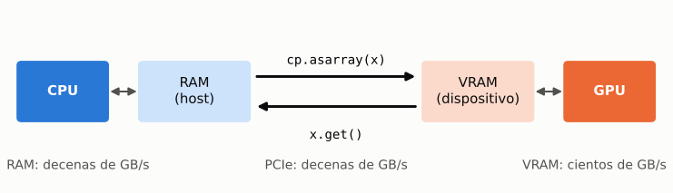

- Mover los datos una vez, calcular mucho, traerlos de vuelta una vez.
- `cp.asarray` dentro de un bucle suele ser más lento que NumPy.

---

# El patrón `xp`: un solo código, dos dispositivos

```python
def run(xp, n, iters, dtype=np.float64):
    u = xp.zeros((n, n), dtype=dtype)       # xp es numpy o cupy
    u[0, :] = 100.0
    unew = u.copy()
    for _ in range(iters):
        step(u, unew)                        # el mismo step de NumPy, sin cambios
        u, unew = unew, u
    return u

check(run(cp, n, iters), run(np, n, iters), np.float64)
```

Los mismos números, en otra memoria. La comprobación va antes que el cronómetro.

---

# ¿Qué mide el cronómetro?

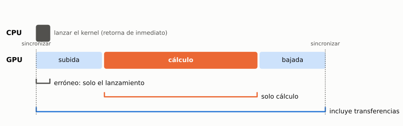

Sin sincronizar, el cronómetro solo ve el lanzamiento: el kernel sigue corriendo.

---

# ¿A partir de qué tamaño gana la GPU?

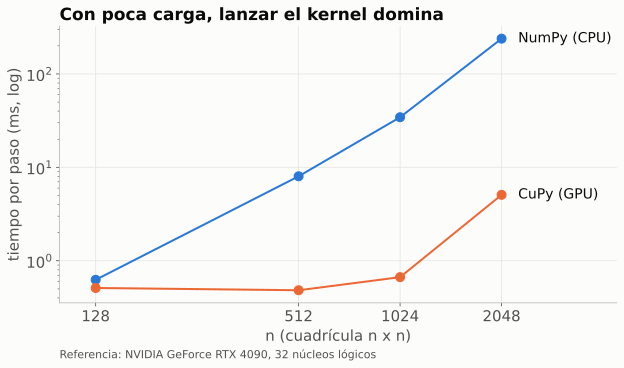

El cruce depende del hardware. Cada entorno de Colab tiene el suyo.

---

# Mismo cálculo, tres números

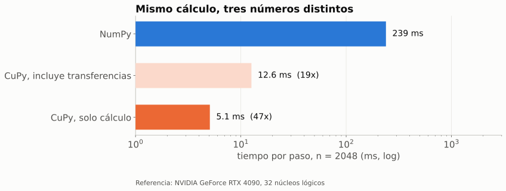

Ante un "40x más rápido": ¿se sincronizó? ¿Incluye transferencias? ¿Mismo trabajo y tipo de dato?

---

<!-- _class: lead -->

# Bloque 4: más allá de una máquina

---

# Máquinas separadas, memorias separadas

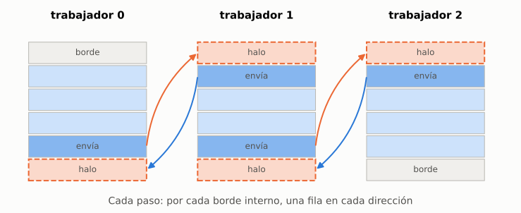

Cada trabajador guarda una fila extra (halo) arriba y abajo, y la actualiza cada paso con la fila de su vecino.

---

# Comunicación frente a cálculo

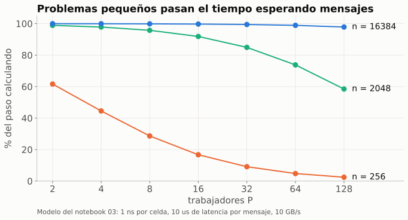

<span class="small">Por paso, cada trabajador calcula `n * n / P` celdas y envía `2n` valores: la razón es `2P / n`, más una latencia fija por mensaje.</span>

---

# Dos modelos de programación

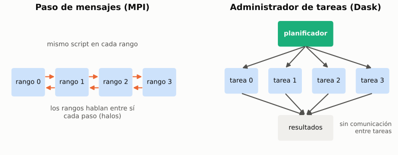

- **MPI (`mpi4py`)**: simulaciones acopladas, halos, comunicación a la medida.
- **Dask, arrays de tareas**: barridos de parámetros, muchos archivos, datos más grandes que una máquina.

---

# Emparejar `Sendrecv` con los halos

```python
from mpi4py import MPI
comm = MPI.COMM_WORLD
rank, size = comm.rank, comm.size
up   = rank - 1 if rank > 0        else MPI.PROC_NULL   # los rangos de borde
down = rank + 1 if rank < size - 1 else MPI.PROC_NULL   # no tienen vecino

for _ in range(iters):
    comm.Sendrecv(s[1],  dest=up,   recvbuf=s[0],  source=up)
    comm.Sendrecv(s[-2], dest=down, recvbuf=s[-1], source=down)
    step(s, snew); s, snew = snew, s
```

Mismas filas y misma dirección que `exchange_halos` del notebook 03. El resto del paso
es el cálculo serial, y el código es igual para 2 rangos o 2000.

---

<!-- _class: lead -->

# Proyecto final

---

# Dos cargas de trabajo, dos respuestas distintas

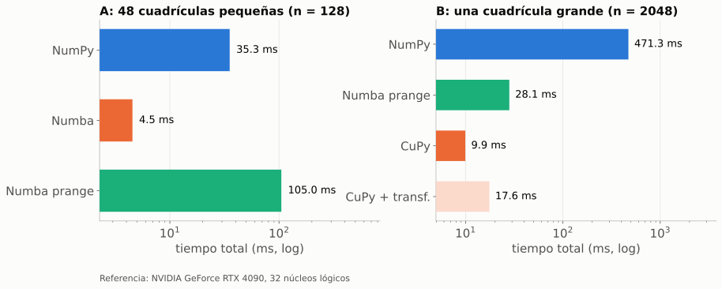

A: muchas cuadrículas pequeñas, `prange` es el más lento. B: una grande, gana la GPU.
¿Qué número de su tabla sostiene su recomendación?

---

# Tabla de decisiones

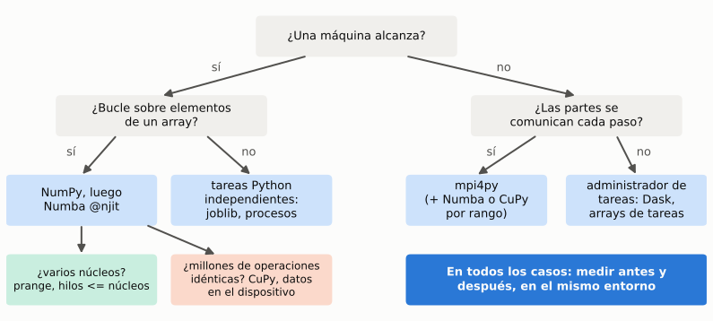

---

# Cuando más hardware no ayuda

| Síntoma | Causa |
|---|---|
| Más hilos, mismo tiempo | la carga es pequeña: iniciar hilos domina |
| La GPU no gana | los datos cruzan PCIe en cada iteración |
| La curva se aplana pronto | el kernel está limitado por memoria y el bus está saturado |
| Hay un techo fijo | la fracción serial (Amdahl) |
| Más máquinas, más lento | la comunicación domina: `2P/n` grande, latencia |

Identifique cuál es **antes** de pedir más máquinas.

---

<!-- _class: lead -->

# Después del evento: notebook 05

---

# Notebook 05: dataframes, ML y marimo

Por cuenta propia. Un notebook **marimo**, no Jupyter. Cubre los temas 4, 5 y 6.

- Datos reales: el flujo de sismos del USGS, últimos 30 días.
- **polars** medido contra **pandas**, en el mismo archivo y el mismo entorno.
- **Regresión lineal** y **random forest** con scikit-learn, en CPU.
- **RAPIDS (cuML)** al final: el mismo ML clásico, en la GPU.

Se ejecuta en molab, no en Colab:
[molab.marimo.io/notebooks/nb_uXzyncAb9w2ZT27r2FuLdN](https://molab.marimo.io/notebooks/nb_uXzyncAb9w2ZT27r2FuLdN)

---

# ¿Por qué polars es más rápido?

| Mecanismo | Qué significa |
|---|---|
| Multihilo por defecto | Usa todos los núcleos sin código paralelo; pandas usa uno |
| Formato Apache Arrow | Columnar, amigable con la caché, sin copias entre herramientas |
| Sin índice | No mantiene ni alinea un índice de filas: desaparece trabajo oculto |
| Rust + SIMD | Núcleos compilados, con instrucciones vectoriales |
| Evaluación diferida | `scan_csv` deja que un optimizador reordene, fusione y omita columnas |

Con pocos datos la diferencia es irrelevante y pandas puede ganar. Se elige por
tamaño de datos y dependencias, no por titulares.

---

# Evaluación ansiosa contra diferida

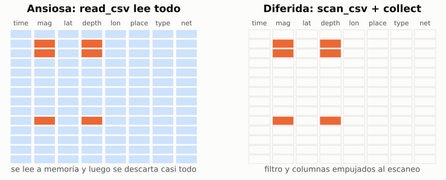

```python
pl.read_csv(ruta).filter(pl.col("mag") > 4).select(["mag", "depth"])            # ansiosa
pl.scan_csv(ruta).filter(pl.col("mag") > 4).select(["mag", "depth"]).collect()  # diferida
```

<span class="small">`explain()` imprime el plan optimizado sin ejecutarlo. Es la misma idea que en HPC: no mover datos que no se usarán.</span>

---

# `n_jobs=-1` no significa "usar la GPU"

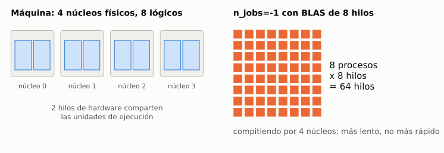

- scikit-learn es una biblioteca **de CPU**; `n_jobs` reparte entre núcleos lógicos.
- `threadpoolctl` muestra los grupos de hilos de BLAS y OpenMP que se multiplican con `n_jobs`.
- A la GPU se llega **cambiando de biblioteca**: RAPIDS (cuML, cuDF), XGBoost.

---

# Reportar el costo junto a la exactitud

| Modelo | Exactitud | Costo de entrenamiento |
|---|---|---|
| Regresión lineal | baja | milisegundos |
| Random forest | mucho mayor | órdenes de magnitud más |

- Una tabla que solo muestra exactitud esconde la mitad de la decisión de ingeniería.
- La validación cruzada indica si el resultado es **estable** o fue una partición afortunada.
- Cada tiempo se escribe a CSV junto al hardware que lo produjo:
  [`data/reference_timings/05_polars_ml.csv`](../data/reference_timings/05_polars_ml.csv).

Un tiempo sin su hardware no es un resultado, igual que en los notebooks 01 y 02.

---

<!-- _class: lead -->

# Medir antes y después, en el mismo entorno

Preguntas: ¿cuándo no ayudaría disponer de más hardware?
